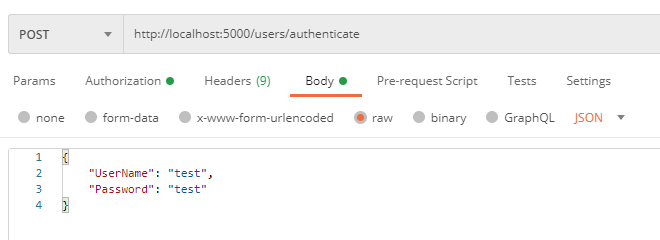
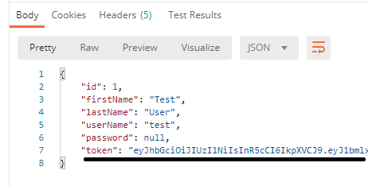
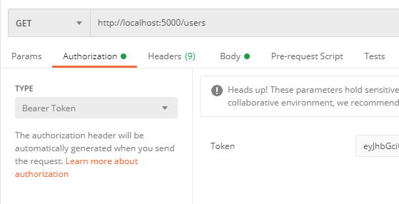

# State and National Parks Locator

#### Latest version date 8/21/2020

#### By Deryck Jackson

## Description

An API for locating state and national parks by name or location.

## User Stories

* As a user I want to be able to make a requests for parks by name
* As a user I want to be able to make requests for parks by location
* As a user I want to be able to see whether parks I have requested are open for the season
* As a user I want to be able to see the parks open hours
* As a user I want to be able to see whether parks I have requested has camping available
* As a user I want to be able to know whether the park has a visitor center
* As a user I want to be able to know where the park is located

## API Documentation

To explore all the endpoints and request formats for this API please refer to the following documentation.

[Documentation](https://app.swaggerhub.com/apis-docs/deryck2/ParksLocator/1.0)

## Setup and Installation

* .NET Core 2.2 will need to be installed, it can be found here https://dotnet.microsoft.com/download/dotnet-core/2.2
* For Mac users, download MySQL here: https://dev.mysql.com/downloads/file/?id=484914
* For Windows users, download MySQL here: https://dev.mysql.com/downloads/file/?id=484919
* You will need a API development tool like Postman or a way to make API requests: https://www.postman.com/downloads/
* to clone this content, copy the url provided by the 'clone or download' button in GitHub
* Navigate to the newly created `ParksLookup.Solution` folder
* Navigate to the `Parks` subfolder and run `dotnet restore`
* Run `dotnet ef database update` in the terminal
* Run `dotnet build` to build the app and `dotnet run` to run it
* The web app will now be available on `http://localhost:5000/api/` in your browser
* You will need to get the JWT Authentication Token, Send the following code in the RAW section of your API request body
  ```
    {
      "User": "test"
      "Password: "test"
    }
  ```
    

* Copy the Token from the Value field of the Token Key from the response body of your request and attach it to the Bearer section of the header section of any requests made to API paths requiring Authentication

  

  

## Tech used

* C# / .NET Core 2.2
* ASP.NET API
* Entity Framework Core
* MYSQL
* CORS

  Note: This app uses CORS which allows requests to be made from different domain origins. If you are planning on expanding on this project please note this makes it less secure than a normal API without CORS implemented. For further info please follow the link below.  
  [CORS Info](https://developer.mozilla.org/en-US/docs/Web/HTTP/CORS)

### License

This project is licensed under the [MIT License](https://opensource.org/licenses/MIT).

Copyright (c) 2020 Deryck Jackson